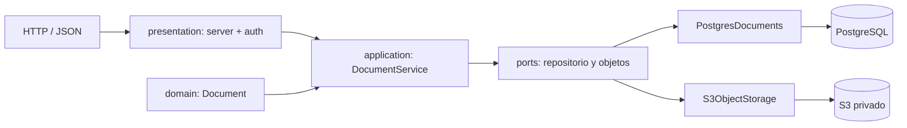

# API de gestión documental

Proyecto Python para el laboratorio AWS. Expone una API JSON y un frontend estático


## Arquitectura




La aplicación sigue una onion:

- `app/domain/`: entidad `Document`, errores de negocio y tiempo UTC.
- `app/application/`: casos de uso y contratos de persistencia/objetos.
- `app/infrastructure/`: adaptadores PostgreSQL, SQLite, archivos locales y S3.
- `app/presentation/`: HTTP/WSGI y autenticación Basic.
- `app/bootstrap.py`: única composición de implementaciones concretas.
- `app/server.py`: entrada compatible para `python -m app.server`.

## Endpoints

La documentación interactiva Swagger está disponible en `/docs`; su especificación OpenAPI se expone en `/api/openapi.json`. Ambos son públicos para que Swagger pueda solicitar las credenciales Basic al probar los endpoints protegidos.

| Método | Ruta | Uso |
|---|---|---|
| POST | `/api/documents` | Crea metadatos (`folio`, `name`, `document_type`, `status` opcional) |
| PUT | `/api/documents/{id}/content` | Sube binario crudo; `Content-Type` describe el archivo |
| GET | `/api/documents/{id}/content` | Descarga localmente o devuelve una URL S3 firmada de 5 minutos |
| GET | `/api/documents/{id}` | Obtiene un documento |
| GET | `/api/documents` | Lista documentos |
| PATCH | `/api/documents/{id}` | Edita `name`, `document_type` o `status` |
| DELETE | `/api/documents/{id}` | Elimina objeto y metadatos |
| GET | `/api/health` | Health check |
| GET | `/api/session` | Usuario y rol de la sesión actual |

Ejemplo de carga:
```sh
curl -X PUT -H 'Content-Type: application/pdf' --data-binary @archivo.pdf http://localhost:8000/api/documents/ID/content
```
