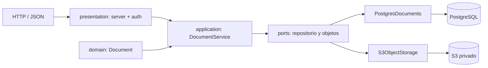

# API de gestión documental

Proyecto Python para el laboratorio DCM 602. Expone una API JSON y un frontend estático; guarda binarios en S3 al configurar el entorno AWS. Para desarrollo local usa SQLite y un directorio local, sin simular que esa configuración es un despliegue cloud.

## Arquitectura




La aplicación sigue una onion mínima, agrupada por responsabilidad:

- `app/domain/`: entidad `Document`, errores de negocio y tiempo UTC.
- `app/application/`: casos de uso y contratos de persistencia/objetos.
- `app/infrastructure/`: adaptadores PostgreSQL, SQLite, archivos locales y S3.
- `app/presentation/`: HTTP/WSGI y autenticación Basic.
- `app/bootstrap.py`: única composición de implementaciones concretas.
- `app/server.py`: entrada compatible para `python -m app.server`.

## Ejecutar localmente

```sh
python3 -m unittest discover -s tests -v
python3 -m app.server
```

Copie `.env.example` a `.env`, complete `DATABASE_URL` y ejecute `python3 -m pip install -r requirements.txt`. El servidor escucha solo en `127.0.0.1` por defecto. Para S3 privado defina `STORAGE_BACKEND=s3`, `S3_BUCKET` y `AWS_REGION`; boto3 usará el **rol IAM de EC2**.

## Usuarios y roles

La API no trae usuarios ni contraseñas en el código. Guarde `AUTH_USERS_JSON` en el gestor de secretos del despliegue y genere cada hash sin exponer la contraseña:

```sh
python3 -m app.auth
```

El comando solicita usuario, rol y contraseña, e imprime el objeto JSON que se añade al arreglo secreto. Los roles son: `viewer` (solo consulta/descarga), `editor` (consulta, crea, edita y sube archivos) y `admin` (lo anterior más eliminar). La autenticación usa HTTP Basic solo sobre el endpoint **HTTPS** de la API.

Para migrar a Cognito, configure `AUTH_MODE=cognito`, `COGNITO_USER_POOL_ID`, `COGNITO_CLIENT_ID` y `AWS_REGION`. La API recibe `Authorization: Bearer <access-token>`, valida el token con Cognito y exige que el usuario pertenezca exactamente a uno de los grupos `viewer`, `editor` o `admin`. El rol IAM de EC2 debe permitir `cognito-idp:AdminListGroupsForUser` únicamente para ese User Pool; el navegador nunca recibe credenciales IAM o S3.

## Endpoints

La documentación interactiva Swagger está disponible en `/docs`; su especificación OpenAPI se expone en `/api/openapi.json`. Ambos son públicos para que Swagger pueda solicitar las credenciales Basic al probar los endpoints protegidos.

| Método | Ruta | Uso |
|---|---|---|
| POST | `/api/documents` | Crea metadatos (`folio`, `name`, `document_type`, `status` opcional) |
| PUT | `/api/documents/{id}/content` | Sube binario crudo; `Content-Type` describe el archivo |
| GET | `/api/documents/{id}/content` | Descarga localmente o devuelve una URL S3 firmada de 5 minutos |
| GET | `/api/documents/{id}` | Obtiene un documento |
| GET | `/api/documents` | Lista documentos |
| PATCH | `/api/documents/{id}` | Edita `name`, `document_type` o `status` |
| DELETE | `/api/documents/{id}` | Elimina objeto y metadatos |
| GET | `/api/health` | Health check |
| GET | `/api/session` | Usuario y rol de la sesión actual |

Ejemplo de carga:
```sh
curl -X PUT -H 'Content-Type: application/pdf' --data-binary @archivo.pdf http://localhost:8000/api/documents/ID/content
```

## Semillas

`python3 -m app.seeds` crea tres metadatos de ejemplo. Es idempotente: no duplica folios existentes.

## Despliegue AWS

La plantilla crea un bucket S3 privado para documentos, una EC2 con permisos mínimos de `PutObject`, `GetObject` y `DeleteObject` solo para `documents/*`, y un bucket web separado. PostgreSQL debe estar en una red privada. `DATABASE_URL`, `AUTH_USERS_JSON` y `CORS_ORIGIN` se instalan como `/opt/document-api/.env` desde un gestor de secretos; nunca se añaden al repositorio, a CloudFormation ni a variables públicas. La API debe exponerse mediante un proxy HTTPS y `CORS_ORIGIN` debe ser el origen exacto del sitio web.

Para publicar el frontend, cambie `web/config.js` con la URL HTTPS pública de la API y copie la carpeta completa al bucket mostrado como `WebBucket`:

```sh
aws s3 sync web/ s3://NOMBRE-DEL-WEB-BUCKET/ --delete
```

El frontend usa `index.html` para el acceso y `documents.html` para el panel protegido; este último redirige al acceso cuando no hay una sesión válida.

Los estilos se compilan con Tailwind CSS y se publican como `web/styles.css` estático. Después de cambiar clases de la web, ejecute:

```sh
npm install
npm run build:css
```

El sitio S3 es público solo para servir los archivos estáticos; documentos, base de datos y secretos siguen privados. Para producción con HTTPS en el frontend, coloque CloudFront delante del bucket y use su URL como `CORS_ORIGIN`.

El diagrama editable está en `infrastructure/diagram-infraestructura.excalidraw`.

## Decisiones de seguridad

- **Secretos:** `.env*` está ignorado excepto `.env.example`; `DATABASE_URL` no se registra ni se devuelve por HTTP.
- **S3 privado:** el bucket bloquea el acceso público y las descargas S3 usan URLs firmadas con vencimiento de cinco minutos.
- **Red:** la API escucha en loopback por defecto. PostgreSQL debe aceptar conexiones solo desde la red/rol de la aplicación, nunca desde Internet.
- **Base de datos:** PostgreSQL es el backend de producción mediante `METADATA_BACKEND=postgres`; SQLite queda solo para pruebas locales.
- **Costos:** eliminar instancias, RDS/NAT/ALB creados después de la presentación.

## Prueba de demo

1. Crear documento desde la web o `curl`.
2. Subir contenido y verificar `status: UPLOADED`.
3. Listar uno y todos.
4. Editar estado/nombre.
5. Borrar y confirmar `404` al consultar.

## Prueba E2E de las seis operaciones

La prueba realiza crear, subir, listar uno, listar todos, editar y borrar contra el despliegue. Requiere un token temporal de Cognito de un usuario `admin`; no lo guarde en Git.

```sh
export API_URL=https://d3cy0g77xzrodj.cloudfront.net
export ACCESS_TOKEN='TOKEN_COGNITO'
./tests/e2e/six_operations.sh demo.pdf
```
